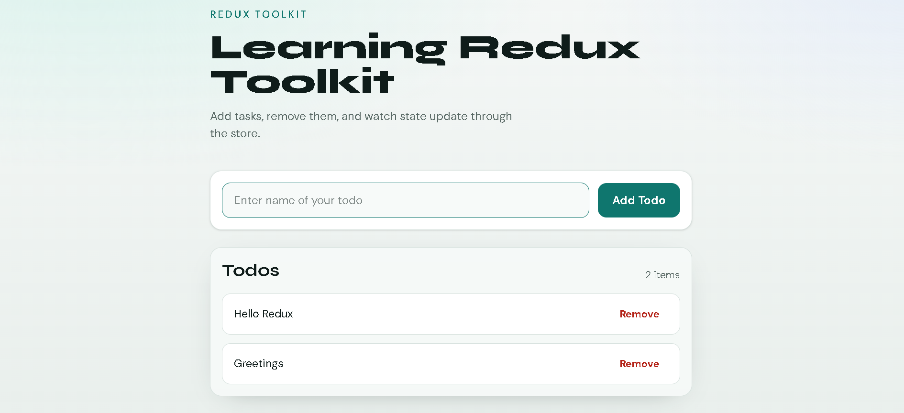

# Redux Toolkit Todo

A simple and clean Todo application built with **React**, **Vite**, **Redux Toolkit**, and **Tailwind CSS**.

This project is part of my frontend learning journey in the [`frontend-mastery`](https://github.com/talha0603/frontend-mastery) repository.


## Demo



## Overview

This app demonstrates how to manage global state using Redux Toolkit. Users can add todos, view the list from the Redux store, and remove items in real time.

## Features

- Add new todo items
- Display todos from Redux global state
- Remove todos with one click
- Clean and responsive UI with Tailwind CSS
- Fast workflow with Bun package manager

## Tech Stack

| Technology | Purpose |
|---|---|
| React | UI library |
| Vite | Development & build tool |
| Redux Toolkit | State management |
| React-Redux | React bindings for Redux |
| Tailwind CSS | Styling |
| Bun | Package manager / runtime |

## Project Structure

```text
reduxToolkitTodo/
├── src/
│   ├── app/
│   │   └── store.js
│   ├── features/
│   │   └── todo/
│   │       └── todoSlice.js
│   ├── components/
│   │   ├── AddTodo.jsx
│   │   └── Todos.jsx
│   ├── App.jsx
│   ├── main.jsx
│   └── index.css
├── public/
├── demo.png
├── index.html
├── package.json
└── vite.config.js
```

## What I Learned

- Creating a Redux store with `configureStore`
- Building slices using `createSlice`
- Using `useDispatch` to send actions
- Using `useSelector` to read state
- Wrapping the app with Redux `<Provider>`
- Understanding Redux state shape (`state.todo.todos`)
- Styling with Tailwind CSS
- Using Bun for package installation

## Getting Started

### Prerequisites

- Node.js or Bun installed on your machine

### Installation

Using Bun (recommended):

```bash
cd reduxToolkitTodo
bun install
```

Or using npm:

```bash
cd reduxToolkitTodo
npm install
```

### Run the project

Using Bun:

```bash
bun run dev
```

Or using npm:

```bash
npm run dev
```

Open the local URL from the terminal (usually `http://localhost:5173`).

## Available Scripts

```bash
bun run dev       # Start development server
bun run build     # Build for production
bun run preview   # Preview production build
```

Same scripts also work with `npm run`.

## How It Works

1. `todoSlice.js` contains the todo state and reducers (`addTodo`, `removeTodo`)
2. `store.js` registers the todo reducer in the Redux store
3. `AddTodo.jsx` dispatches the `addTodo` action
4. `Todos.jsx` reads todos with `useSelector` and dispatches `removeTodo`
5. `index.css` + Tailwind classes handle the UI styling

## Author

**Talha**  
GitHub: [talha0603](https://github.com/talha0603)

## License

This project is for learning purposes.
